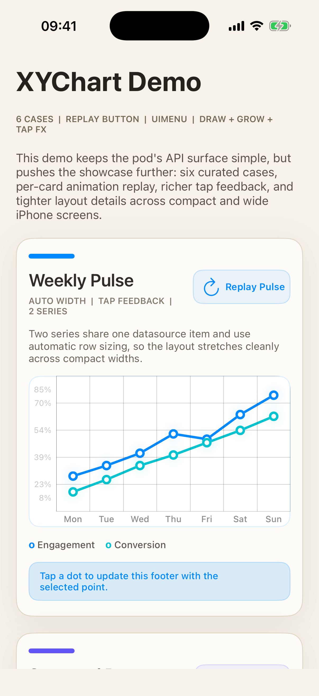
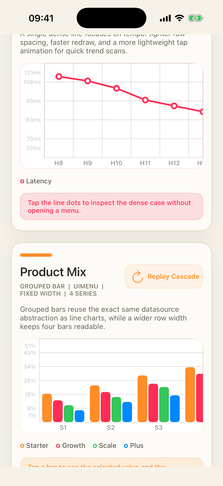

# XYChart

Lightweight Objective-C line and bar charts with configurable range, layout, tap interaction, and replayable entry animation.

## Preview

Real screenshots from the generated pure-code demo on the current iPhone simulator:

<p align="center">
  
  
</p>

## Highlights

- Pure Objective-C, UIKit based.
- Supports line charts and grouped/single bar charts.
- Multi-series comparison through one datasource abstraction.
- Configurable visible range, number of levels, and row width.
- Tap callbacks can drive custom animations or `UIMenuController` values.
- Entry animation timing is controlled by each `XYChartItem.duration`.
- Demo is now pure code only and generated from `XcodeGen + CocoaPods`.

## Install

```ruby
pod 'XYChart'
```

Requirements:

- iOS 12.0+ for the pod
- CocoaPods

## Repo Layout

- `XYChart/`: pod core source
- `Demo/Sources/`: pure-code demo logic
- `Demo/project.yml`: XcodeGen definition for the demo app
- `Demo/Podfile`: CocoaPods integration for the demo app
- `docs/images/`: README preview screenshots
- `GenerateDemo.command`: one-click bootstrap script for the demo

## Run Demo

One-click:

```bash
./GenerateDemo.command
```

Manual:

```bash
brew install xcodegen cocoapods
cd Demo
xcodegen generate
pod install
open XYChartDemo.xcworkspace
```

Notes:

- Open `XYChartDemo.xcworkspace`, not the generated `.xcodeproj`.
- Generated files such as `Pods/`, `.xcworkspace`, and `.xcodeproj` are not part of the repo core.
- If you change `Demo/project.yml` or `Demo/Podfile`, rerun `xcodegen generate` and `pod install`.
- The demo app itself targets iOS 13.0 because it uses modern scene lifecycle and current iPhone layout APIs.

## Quick Start

```objective-c
#import <XYChart/XYChart.h>
#import <XYChart/XYChartItem.h>
#import <XYChart/XYChartDataSourceItem.h>

XYChartItem *lineA1 = [XYChartItem new];
lineA1.value = @28;
lineA1.color = UIColor.systemBlueColor;
lineA1.duration = 0.22;
lineA1.showName = @"Engagement | Mon | 28%";

XYChartItem *lineA2 = [XYChartItem new];
lineA2.value = @34;
lineA2.color = UIColor.systemBlueColor;
lineA2.duration = 0.22;
lineA2.showName = @"Engagement | Tue | 34%";

XYChartItem *lineB1 = [XYChartItem new];
lineB1.value = @19;
lineB1.color = UIColor.systemTealColor;
lineB1.duration = 0.25;
lineB1.showName = @"Conversion | Mon | 19%";

XYChartItem *lineB2 = [XYChartItem new];
lineB2.value = @26;
lineB2.color = UIColor.systemTealColor;
lineB2.duration = 0.25;
lineB2.showName = @"Conversion | Tue | 26%";

XYChartDataSourceItem *dataSource = [[XYChartDataSourceItem alloc] initWithDataList:@[
    @[lineA1, lineA2],
    @[lineB1, lineB2]
]];

dataSource.configuration.numberOfLevels = 5;
dataSource.configuration.autoSizingRowWidth = YES;
dataSource.configuration.automaticallyAdjustsVisibleRange = YES;

XYChart *chartView = [[XYChart alloc] initWithType:XYChartTypeLine];
chartView.delegate = self;
[chartView setDataSource:dataSource animation:YES];
[self.view addSubview:chartView];
```

## Core API

### `XYChart`

```objective-c
@interface XYChart : UIView<XYChartReload>

@property (nonatomic, weak, nullable) id<XYChartDataSource> dataSource;
@property (nonatomic, weak, nullable) id<XYChartDelegate> delegate;
@property (nonatomic, copy, nullable) XYChartConfiguration *configuration;
@property (nonatomic, readonly) XYChartType type;

- (instancetype)initWithFrame:(CGRect)frame type:(XYChartType)type;
- (instancetype)initWithType:(XYChartType)type;
- (void)setDataSource:(id<XYChartDataSource>)dataSource animation:(BOOL)animation;
- (void)reloadData:(BOOL)animation;

@end
```

### `XYChartConfiguration`

```objective-c
XYChartConfiguration *configuration = [XYChartConfiguration defaultConfiguration];
configuration.visibleRange = XYRangeMake(0, 100);
configuration.automaticallyAdjustsVisibleRange = YES;
configuration.numberOfLevels = 6;
configuration.autoSizingRowWidth = NO;
configuration.rowWidth = 52.0;
```

Available properties:

- `visibleRange`
- `automaticallyAdjustsVisibleRange`
- `numberOfLevels`
- `rowWidth`
- `autoSizingRowWidth`

### `XYChartItem`

```objective-c
XYChartItem *item = [XYChartItem new];
item.value = @42;
item.color = UIColor.systemBlueColor;
item.duration = 0.22;
item.showName = @"North | Jan | 42k";
```

Notes:

- `duration` controls line draw speed, point reveal timing, and bar grow timing.
- `showName` is used by `UIMenuController` when menu display is enabled.

### `XYChartDataSource`

Required methods:

```objective-c
- (NSUInteger)numberOfSectionsInChart:(XYChart *)chart;
- (NSUInteger)numberOfRowsInChart:(XYChart *)chart;
- (NSAttributedString *)chart:(XYChart *)chart titleOfRowAtIndex:(NSUInteger)index;
- (id<XYChartItem>)chart:(XYChart *)chart itemOfIndex:(NSIndexPath *)index;
```

Optional methods:

```objective-c
- (nullable XYChartConfiguration *)chartConfiguration:(XYChart *)chart;
- (NSAttributedString *)chart:(XYChart *)chart titleOfSectionAtValue:(CGFloat)sectionValue;
- (BOOL)autoSizingRowInChart:(XYChart *)chart;
- (CGFloat)rowWidthOfChart:(XYChart *)chart;
- (NSUInteger)numberOfLevelInChart:(XYChart *)chart;
- (XYRange)visibleRangeInChart:(XYChart *)chart;
```

### `XYChartDelegate`

```objective-c
- (BOOL)chart:(XYChart *)chart shouldShowMenu:(NSIndexPath *)index;
- (void)chart:(XYChart *)chart itemDidClick:(id<XYChartItem>)item;
- (CAAnimation *)chart:(XYChart *)chart clickAnimationOfIndex:(NSIndexPath *)index;
```

Typical uses:

- decide whether a tapped point or bar should show `UIMenuController`
- update footer text or external labels when the user taps a value
- provide custom tap feedback animations per chart or per index

## Demo Coverage

The current demo app includes:

- 3 line cases
- 3 bar cases
- replay button per card
- `UIMenuController` value display
- sequential line draw and bar grow animation
- pure-code layout that supports current iPhone safe areas and screen sizes

## Development Notes

- The demo app uses `UIScene` lifecycle and a pure-code `SceneDelegate`.
- The generated demo project is intentionally disposable; edit source and config, then regenerate.
- For local verification:

```bash
cd Demo
xcodegen generate
pod install
xcodebuild -workspace XYChartDemo.xcworkspace -scheme XYChartDemo -configuration Debug -destination 'generic/platform=iOS Simulator' build
```

## Author

XcodeYang, xcodeyang@gmail.com

## License

XYChart is available under the MIT license. See [LICENSE](LICENSE).
